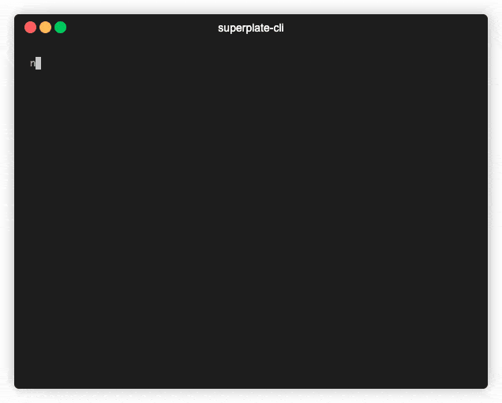
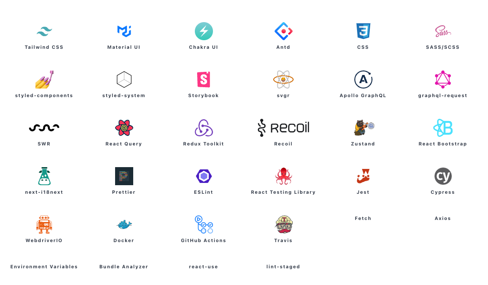

<div align="center">
<p align='center'>

</p>
</div>
<br/>
<div align="center">A well-structured production-ready frontend boilerplate with Typescript, React Testing Library, styled-component, React Query, .env, Axios, Bundle Analyzer, Prettier and <b>30+ plugins</b>. <div><b>PlateDev</b> creates ready-to-develop projects for React and Next.js and refine.</div></div>
<br/>

<div align="center">


</div>


<br/>

## About 

**PlateDev** lets you start rock-solid, production-ready _React_, _Next.JS_ and _refine_ projects just in seconds. The command-line interface guides the user through setup and no additional build configurations are required.

PlateDev ships with +30 plugins including popular UI Kits, testing frameworks and many useful developer tools.

## Quick Start

To use PlateDev, make sure you have _npx_ is installed on your system (npx is shipped by default since npm 5.2.0).

To create a new app without using presets, run the following command:

```bash
npx PlateDev-cli my-project
```


## Available Integrations

### Next.js 


**PlateDev**  makes it easier to get up and running with a well-structured Next.js and TypeScript application.


To get started quickly, please run the following command. The CLI wizard will assist you for the rest of the setup process:

```
npx PlateDev-cli -p nextjs my-project
```

### React.js 

<br>

**PlateDev**  makes it easier to get up and running with a well-structured Create React App and TypeScript application.

To get started quickly, please run the following command. The CLI wizard will assist you for the rest of the setup process:

```
npx PlateDev-cli -p react my-project
```

### refine ⚡
[refine](https://github.com/Kobayashi19860206/refine) is an open source React framework for building **CRUD** apps rapidly.

**PlateDev** provides built-in templates for CRA, Next.js and Remix environments so you can bootstrap a **refine** project in a couple of minutes. 

[Refer to refine repository for more information ➡️ ](https://github.com/Kobayashi19860206/refine)

<br/>
<a href="https://github.com/Kobayashi19860206/refine">
<picture>
  <source media="(prefers-color-scheme: dark)" srcset="https://user-images.githubusercontent.com/18739364/200257042-3f2aa7f7-a07f-4824-8d2a-b25f26b6fd32.png">
  
</picture>
</a>

<br/>
<br/>


To get started quickly, please run the following command. The CLI wizard will assist you for the rest of the setup process:

```
npx PlateDev-cli -p refine my-project
```

<br>

## Coming Soon


## Documentation


## Philosophy

-   It provides an easy starting to your project by leveraging industry-standard best practices and and performance oriented tools.
-   Fully extensible due its plugin based architechture.
-   Code examples are added to plugin documents to show how best practices are implemented.


## Available plugins



## CLI options

```
> npx PlateDev-cli --help
Usage: PlateDev [options]

Options:
 -v, --version                   prints version number
 -h, --help                      prints help information on all commands and options
 -d, --debug                     prints additional logs
 -s, --source <path-to-source>   Use this option to target a custom source of plugins
                                 Source path can be a remote git repository or a local path.
 -p, --project <project-type>    In sources with multiple types, you can use this option to preset the type.
 -b, --branch <branch-name>      If your source is a git repository, you can define a custom branch for `PlateDev` to use.
 -o, --preset <preset-name>      If your source includes presets, you can select one of them to prefill the answers.
 -l, --lucky                     You can select random choices with this option, if you are feeling lucky.
```

## Development mode commands

Watches for changes in the code; builds the project and then globally installs PlateDev for testing.

```
npm run dev:global
```

Create a build inside `/lib` directory.

```
npm run build:cli
```

Install the current build globally:

```
npm run global
```

## Contribution

If you have a bug to report, do not hesitate to file an issue.

If you are willing to fix an issue or propose a feature; all PRs with clear explanations are welcome and encouraged.

## License

Licensed under the MIT License, Copyright © 2021-present Kobayashi19860206
